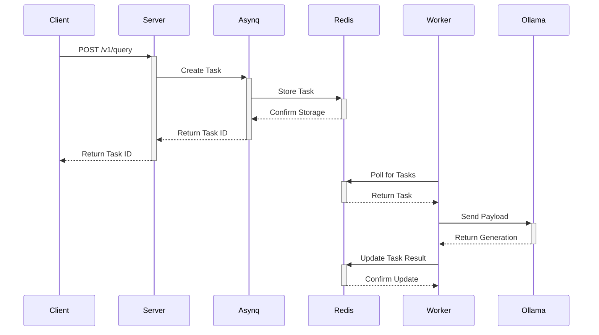
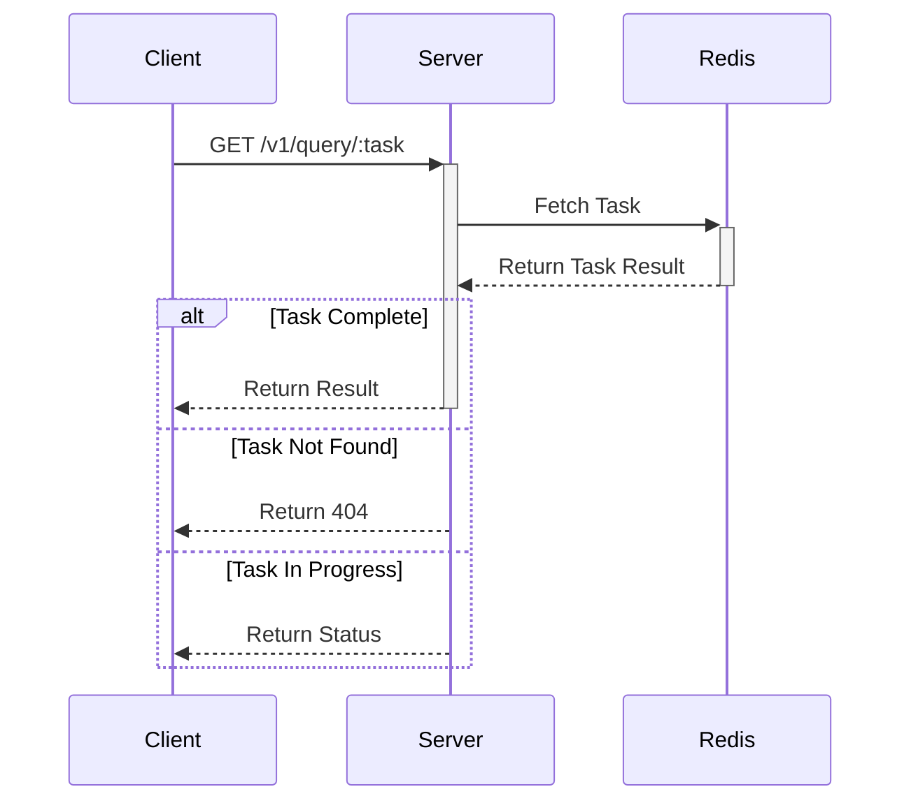

# Diagrams

## POST :: /v1/query

```mermaid
sequenceDiagram
    participant C as Client
    participant S as Server
    participant A as Asynq
    participant R as Redis
    participant W as Worker
    participant O as Ollama

    C->>+S: POST /v1/query
    S->>+A: Create Task
    A->>+R: Store Task
    R-->>-A: Confirm Storage
    A-->>-S: Return Task ID
    S-->>-C: Return Task ID

    W->>+R: Poll for Tasks
    R-->>-W: Return Task
    W->>+O: Send Payload
    O-->>-W: Return Generation
    W->>+R: Update Task Result
    R-->>-W: Confirm Update
```

## GET :: /v1/query

```mermaid
sequenceDiagram
    participant C as Client
    participant S as Server
    participant R as Redis

    C->>+S: GET /v1/query/:task
    S->>+R: Fetch Task
    R-->>-S: Return Task Result
    
    alt Task Complete
        S-->>-C: Return Result
    else Task Not Found
        S-->>C: Return 404
    else Task In Progress
        S-->>C: Return Status
    end
```
